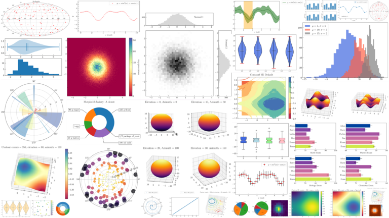
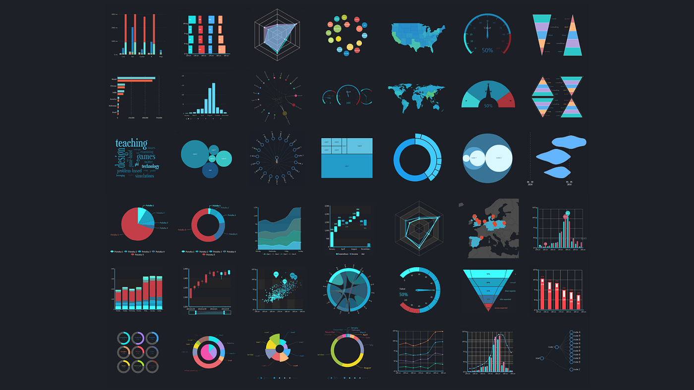

<a href="https://platzi.com/cursos/matplotlib-seaborn/">

<h1 align="center">Visualización de Datos con Matplotlib y Seaborn</h1>

  

  Este proyecto fue hecho en VS Code con Jupyter Notebooks. Por
    <a href="https://github.com/DensLopez">Dennis</a>.
  

 
 

Este repositorio está relacionado al curso de "Visualización de Datos con Matplotlib y Seaborn" tomado en Platzi. Además, contiene archivos "ipynb" y "HTML" con los códigos desarrollados en el curso y explicaciones por cada archivo.

 

<h1 align="center">Acerca de </h1>

## Matplotlib

[Matplotlib](https://matplotlib.org/) es una librería Python open source que permite crear visualizaciones de datos. La visualización de datos es una etapa clave del análisis de datos. Después de haber recopilado, almacenado y analizado datos, es esencial transformar los resultados de esos análisis en informes y visualizaciones gráficas.

Y con razón, el cerebro humano comprende más rápido un diagrama que una sucesión de estadísticas en forma de tabla. La “Dataviz” permite, por tanto, compartir los resultados de un análisis con los equipos no técnicos de una empresa, y en particular con sus dirigentes.

  

 

## **Seaborn**

[Seaborn](https://seaborn.pydata.org/) es una herramienta de Data Visualization en lenguaje Python. La Data Visualization es una técnica que permite a los Data Scientits transformar los datos brutos en gráficos y diagramas. Estas ilustraciones facilitan la lectura y comprensión de los datos, por eso DataViz es tan útil.

Existen muchas herramientas «no-code» que permiten crear visualizaciones de datos: Tableau, Power BI, ChartBlocks, etc., sin embargo, como alternativa, también es posible optar por el lenguaje Python.

Esto requiere conocimientos de programación, pero te ofrece total libertad. Con Python es posible procesar, transformar y crear visualizaciones de datos. Muchos Data Scientists recurren a esta solución.

Una de las razones por las que Python es la mejor opción para la Data Science es su amplio ecosistema de bibliotecas. Hay muchas bibliotecas de Python para manipular datos: NumPy, Pandas, Matplotlib, TensorFlow, etc.

Aunque Matplotlib es muy popular para crear visualizaciones de datos, su uso puede resultar complejo. Algunos desarrolladores han creado una nueva biblioteca basada en Matplotlib: Seaborn.

  

 

## Temario

### Matplotlib

- Pyplot básico - [code001.ipynb](codes/code001.ipynb), [code001.html](codes/html/code001.html), [code001.pdf](codes/pdfs/code001.pdf).
- Subplot - [code002.ipynb](codes/code002.ipynb), [code002.html](codes/html/code002.html), [code002.pdf](codes/pdfs/code002.pdf).
- Método orientado a objetos - [code003.ipynb](codes/code003.ipynb), [code003.html](codes/html/code003.html), [code003.pdf](codes/pdfs/code003.pdf).
- Subplots.
- Leyendas, etiquetas, títulos y tamaño.
- Colores y estilos.
- Bar plot.
- Crear otro tipo de gráficas.
- Quiz matplotlib.

### Seaborn

- Set.
- Parámetros más usados en Seaborn.
- Distribuciones.
- Categóricos.
- Relation.
- Jointplot y Pairplot.
- Heatmap.
- Quiz seaborn.

-----------------------------

<h2 align="center">Extra</h2>

### ¿Quieres saber más?

[Matplotlib documentation](https://matplotlib.org/stable/index.html)

[Seaborn: statistical data visualization](https://seaborn.pydata.org/)

 
